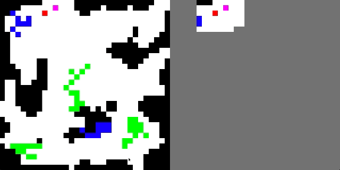

# teamwork_marl
Teamwork-based map exploration through multi-agent reinforcement learning (MARL).

This project implements the QMIX learning algorithm, training multiple agents with heterogeneous capabilities to efficiently and quickly explore a randomly  generated map.

**Example:**

Two agents explore a random map. The red agent can move through green tiles while the purple agent can move through blue tiles. The left side of the gif below shows the "ground truth" global state, while the right side shows the red agent's observation combined with the purple agent's observation history (i.e. the shared local observations).

## Project Breakdown

### Map Engine

The Map Engine randomly generates explorable areas and handles agent actions. It receives agent action tensors as input and outputs the global ground truth state and each agent's shared local observations.

### QMIX implementation

The QMIX algorithm is implemented with PyTorch / TorchRL.

## Versions

TODO: get versions of python, packages, cuda, etc.